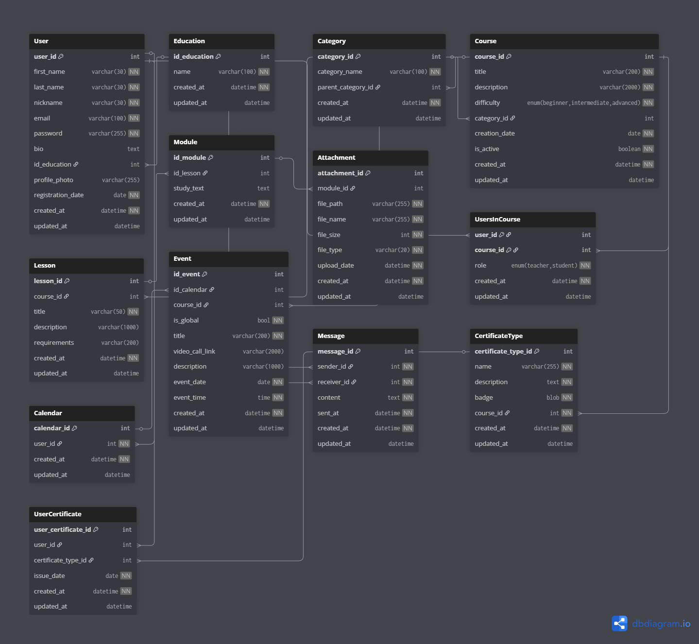

# 🎓 E-Learning Course Platform Database 📚

> **⚠️ School Project Notice**  
> This is an educational project created for learning purposes. To keep the scope manageable, many advanced features (like real-time notifications, advanced analytics, payment processing, etc.) have been intentionally omitted. Despite these simplifications, the project demonstrates a comprehensive understanding of relational database design principles.

---

## 🎯 The Problem We're Solving

In today's digital age, online education has become essential, but many platforms struggle with organizing educational content in a structured, scalable way. The challenge is to create a database system that can:

- **📋 Organize Complex Content**: Manage courses broken down into lessons and modules with various attachment types
- **👥 Support Multiple Roles**: Enable both teachers and students to interact within the same platform
- **🗂️ Categorize Effectively**: Implement hierarchical category structures for easy course discovery
- **📆 Coordinate Schedules**: Provide calendar functionality for personal and course-wide events
- **💬 Enable Communication**: Facilitate direct messaging between platform users
- **🏆 Track Achievement**: Issue and manage course completion certificates



---

## 🔧 How It Works

### **High-Level Architecture**

This e-learning platform operates on a **relational database model** that connects users, courses, educational content, communication, and achievement tracking through carefully designed relationships.

#### **🌟 Core Workflow:**

1. **👤 User Registration & Profiles**
   - Users register with their personal information and educational background
   - Each user gets a unique profile with customizable bio and photo
   - Users can have different roles in different courses (teacher in one, student in another)

2. **📚 Course Creation & Organization**
   - Courses are organized into hierarchical categories (e.g., Technology → Programming → Python)
   - Each course has difficulty levels (beginner, intermediate, advanced)
   - Courses contain multiple lessons, and lessons contain multiple modules
   - Modules can have various attachments (videos, documents, slides)

3. **🎓 Enrollment & Learning**
   - Users join courses through the `UsersInCourse` junction table
   - Students progress through lessons and modules
   - Teachers manage course content and student participation

4. **📅 Scheduling & Events**
   - Each user has a personal calendar
   - Events can be personal or global (shared with all course members)
   - Video call links can be attached to events for virtual classes

5. **💬 Communication**
   - Direct messaging system enables one-to-one conversations
   - Messages are tracked with timestamps for conversation history

6. **🏆 Certification**
   - Course-specific certificate types are defined with unique badges
   - Upon completion, students receive certificates tracked by issue date
   - Prevents duplicate certificates through unique constraints

---

## 📊 Database Import Files

The `making_database/` folder contains SQL files for setting up the database in phpMyAdmin:

- **`e_learning_course.sql`** - Core database structure and table definitions
- **`e_learning_lessons_modules_attachments.sql`** - Educational content data
- **`e_learning_complete_data_dummy.sql`** - Complete dummy data for testing

---

## 📋 Detailed Database Schema

### **Table: `User` 👤**
Stores all user information and authentication details.

| Column | Type | Constraints | Description |
|--------|------|-------------|-------------|
| `user_id` | `int` | 🔑 PK, Auto Increment | Unique identifier for each user |
| `first_name` | `varchar(30)` | ❗ NOT NULL | User's first name |
| `last_name` | `varchar(30)` | ❗ NOT NULL | User's last name |
| `nickname` | `varchar(30)` | 🔒 UNIQUE, NOT NULL | Unique username for the platform |
| `email` | `varchar(100)` | 🔒 UNIQUE, NOT NULL | User's email address |
| `password` | `varchar(255)` | ❗ NOT NULL | Hashed password for security |
| `bio` | `text` | ⭕ Nullable | User's personal biography |
| `id_education` | `int` | 🔗 FK → Education | Reference to educational background |
| `profile_photo` | `varchar(255)` | ⭕ Nullable | Path to profile picture |
| `registration_date` | `date` | ❗ NOT NULL | Account creation date |
| `created_at` | `datetime` | ❗ NOT NULL | Record creation timestamp |
| `updated_at` | `datetime` | ⭕ Nullable | Last update timestamp |

**Indexes:**
- 📌 `idx_student_email` on `email`
- 📌 `idx_student_education` on `id_education`
- 📌 `idx_nickname` on `nickname`

---

### **Table: `Education` 🎓**
Stores predefined educational qualification levels.

| Column | Type | Constraints | Description |
|--------|------|-------------|-------------|
| `id_education` | `int` | 🔑 PK, Auto Increment | Unique education level ID |
| `name` | `varchar(100)` | ❗ NOT NULL | Name of the qualification (e.g., "Bachelor's Degree") |
| `created_at` | `datetime` | ❗ NOT NULL | Record creation timestamp |
| `updated_at` | `datetime` | ⭕ Nullable | Last update timestamp |

---

### **Table: `Category` 🏷️**
Hierarchical course categorization system.

| Column | Type | Constraints | Description |
|--------|------|-------------|-------------|
| `category_id` | `int` | 🔑 PK, Auto Increment | Unique category identifier |
| `category_name` | `varchar(100)` | ❗ NOT NULL | Category name |
| `parent_category_id` | `int` | 🔗 FK → Category (self-reference) | Parent category for hierarchy |
| `created_at` | `datetime` | ❗ NOT NULL | Record creation timestamp |
| `updated_at` | `datetime` | ⭕ Nullable | Last update timestamp |

**Indexes:**
- 📌 `uq_category_name` (UNIQUE) on `category_name`

---

### **Table: `Course` 💻**
Stores all courses available on the platform.

| Column | Type | Constraints | Description |
|--------|------|-------------|-------------|
| `course_id` | `int` | 🔑 PK, Auto Increment | Unique course identifier |
| `title` | `varchar(200)` | ❗ NOT NULL | Course title |
| `description` | `varchar(2000)` | ❗ NOT NULL | Detailed course description |
| `difficulty` | `enum` | ❗ NOT NULL | 'beginner', 'intermediate', or 'advanced' |
| `category_id` | `int` | 🔗 FK → Category | Course category |
| `creation_date` | `date` | ❗ NOT NULL | Course creation date |
| `is_active` | `boolean` | ❗ NOT NULL | Whether course is currently active |
| `created_at` | `datetime` | ❗ NOT NULL | Record creation timestamp |
| `updated_at` | `datetime` | ⭕ Nullable | Last update timestamp |

**Indexes:**
- 📌 `idx_course_category` on `category_id`
- 📌 `idx_course_title` on `title`

---

### **Table: `Lesson` 📖**
Individual lessons within a course.

| Column | Type | Constraints | Description |
|--------|------|-------------|-------------|
| `lesson_id` | `int` | 🔑 PK, Auto Increment | Unique lesson identifier |
| `course_id` | `int` | 🔗 FK → Course | Parent course |
| `title` | `varchar(50)` | ❗ NOT NULL | Lesson title |
| `description` | `varchar(1000)` | ⭕ Nullable | Lesson description |
| `requirements` | `varchar(200)` | ⭕ Nullable | Prerequisites for the lesson |
| `created_at` | `datetime` | ❗ NOT NULL | Record creation timestamp |
| `updated_at` | `datetime` | ⭕ Nullable | Last update timestamp |

**Indexes:**
- 📌 `idx_lesson_course` on `course_id`
- 📌 `idx_lesson_title` on `title`

---

### **Table: `Module` 🧩**
Educational content modules within lessons.

| Column | Type | Constraints | Description |
|--------|------|-------------|-------------|
| `id_module` | `int` | 🔑 PK, Auto Increment | Unique module identifier |
| `id_lesson` | `int` | 🔗 FK → Lesson | Parent lesson |
| `study_text` | `text` | ⭕ Nullable | Main learning content |
| `created_at` | `datetime` | ❗ NOT NULL | Record creation timestamp |
| `updated_at` | `datetime` | ⭕ Nullable | Last update timestamp |

**Indexes:**
- 📌 `idx_module_lesson` on `id_lesson`

---

### **Table: `Attachment` 📎**
Files attached to modules (videos, documents, etc.).

| Column | Type | Constraints | Description |
|--------|------|-------------|-------------|
| `attachment_id` | `int` | 🔑 PK, Auto Increment | Unique attachment identifier |
| `module_id` | `int` | 🔗 FK → Module | Parent module |
| `file_path` | `varchar(255)` | ❗ NOT NULL | File storage path |
| `file_name` | `varchar(255)` | ❗ NOT NULL | Original file name |
| `file_size` | `int` | ❗ NOT NULL | File size in bytes |
| `file_type` | `varchar(20)` | ❗ NOT NULL | MIME type |
| `upload_date` | `datetime` | ❗ NOT NULL | Upload timestamp |
| `created_at` | `datetime` | ❗ NOT NULL | Record creation timestamp |
| `updated_at` | `datetime` | ⭕ Nullable | Last update timestamp |

**Indexes:**
- 📌 `idx_attachment_module` on `module_id`

---

### **Table: `UsersInCourse` 👥**
Junction table linking users to courses with their roles.

| Column | Type | Constraints | Description |
|--------|------|-------------|-------------|
| `user_id` | `int` | 🔑 PK (composite), FK → User | User identifier |
| `course_id` | `int` | 🔑 PK (composite), FK → Course | Course identifier |
| `role` | `enum` | ❗ NOT NULL | 'teacher' or 'student' |
| `created_at` | `datetime` | ❗ NOT NULL | Enrollment timestamp |
| `updated_at` | `datetime` | ⭕ Nullable | Last update timestamp |

**Indexes:**
- 📌 `idx_users_in_course_role` on `role`

---

### **Table: `Calendar` 📅**
Personal calendar for each user.

| Column | Type | Constraints | Description |
|--------|------|-------------|-------------|
| `calendar_id` | `int` | 🔑 PK, Auto Increment | Unique calendar identifier |
| `user_id` | `int` | 🔒 UNIQUE, NOT NULL, FK → User | Calendar owner |
| `created_at` | `datetime` | ❗ NOT NULL | Record creation timestamp |
| `updated_at` | `datetime` | ⭕ Nullable | Last update timestamp |

---

### **Table: `Event` 🎉**
Events and reminders in user calendars.

| Column | Type | Constraints | Description |
|--------|------|-------------|-------------|
| `id_event` | `int` | 🔑 PK, Auto Increment | Unique event identifier |
| `id_calendar` | `int` | 🔗 FK → Calendar | Parent calendar |
| `course_id` | `int` | 🔗 FK → Course | Related course (if applicable) |
| `is_global` | `bool` | ❗ NOT NULL | Whether event is shared with course |
| `title` | `varchar(200)` | ❗ NOT NULL | Event title |
| `video_call_link` | `varchar(2000)` | ⭕ Nullable | Virtual meeting link |
| `description` | `varchar(1000)` | ⭕ Nullable | Event description |
| `event_date` | `date` | ❗ NOT NULL | Event date |
| `event_time` | `time` | ❗ NOT NULL | Event time |
| `created_at` | `datetime` | ❗ NOT NULL | Record creation timestamp |
| `updated_at` | `datetime` | ⭕ Nullable | Last update timestamp |

**Indexes:**
- 📌 `idx_event_course` on `course_id`
- 📌 `idx_event_datetime` on `event_date`, `event_time`

---

### **Table: `Message` 💬**
One-to-one messaging between users.

| Column | Type | Constraints | Description |
|--------|------|-------------|-------------|
| `message_id` | `int` | 🔑 PK, Auto Increment | Unique message identifier |
| `sender_id` | `int` | ❗ NOT NULL, FK → User | Message sender |
| `receiver_id` | `int` | ❗ NOT NULL, FK → User | Message recipient |
| `content` | `text` | ❗ NOT NULL | Message content |
| `sent_at` | `datetime` | ❗ NOT NULL | Send timestamp |
| `created_at` | `datetime` | ❗ NOT NULL | Record creation timestamp |
| `updated_at` | `datetime` | ⭕ Nullable | Last update timestamp |

**Indexes:**
- 📌 `idx_message_sent_at` on `sent_at`
- 📌 `idx_sender_id` on `sender_id`, `sent_at`
- 📌 `idx_receiver_id` on `receiver_id`, `sent_at`

---

### **Table: `CertificateType` 🏆**
Defines certificate templates for courses.

| Column | Type | Constraints | Description |
|--------|------|-------------|-------------|
| `certificate_type_id` | `int` | 🔑 PK, Auto Increment | Unique certificate type ID |
| `name` | `varchar(255)` | ❗ NOT NULL | Certificate name |
| `description` | `text` | ❗ NOT NULL | Certificate description |
| `badge` | `blob` | ❗ NOT NULL | Certificate badge image |
| `course_id` | `int` | 🔒 UNIQUE, NOT NULL, FK → Course | Associated course |
| `created_at` | `datetime` | ❗ NOT NULL | Record creation timestamp |
| `updated_at` | `datetime` | ⭕ Nullable | Last update timestamp |

---

### **Table: `UserCertificate` 📜**
Tracks certificates awarded to users.

| Column | Type | Constraints | Description |
|--------|------|-------------|-------------|
| `user_certificate_id` | `int` | 🔑 PK, Auto Increment | Unique award identifier |
| `user_id` | `int` | 🔗 FK → User | Certificate recipient |
| `certificate_type_id` | `int` | 🔗 FK → CertificateType | Certificate type |
| `issue_date` | `date` | ❗ NOT NULL | Date certificate was issued |
| `created_at` | `datetime` | ❗ NOT NULL | Record creation timestamp |
| `updated_at` | `datetime` | ⭕ Nullable | Last update timestamp |

**Indexes:**
- 📌 `uq_user_certificate` (UNIQUE) on `user_id`, `certificate_type_id`

---

## 🔗 Entity Relationships

```
User ──┬── Education (Many-to-One)
       ├── UsersInCourse (Many-to-Many with Course)
       ├── Calendar (One-to-One)
       ├── Message (One-to-Many as sender/receiver)
       └── UserCertificate (One-to-Many)

Course ──┬── Category (Many-to-One)
         ├── Lesson (One-to-Many)
         ├── UsersInCourse (Many-to-Many with User)
         ├── Event (One-to-Many)
         └── CertificateType (One-to-One)

Lesson ──── Module (One-to-Many)

Module ──── Attachment (One-to-Many)

Calendar ──── Event (One-to-Many)

CertificateType ──── UserCertificate (One-to-Many)

Category ──── Category (Self-referencing hierarchy)
```

---

## 🛠️ Technologies Used

- **Database**: MySQL
- **Tools**: phpMyAdmin
- **Design**: dbdiagram.io

---

## 📝 License

This is a school project for educational purposes only.

---

**Made with 💙 for learning database design**

**Made with 💙 for learning database design**
